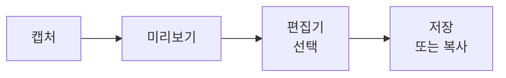

# ChalKak 사용자 가이드

[English Guide](USER_GUIDE.md)

ChalKak은 Wayland + Hyprland 환경을 위한 미리보기 중심 스크린샷 도구입니다. 캡처, 확인, 주석, 공유를 키보드 중심으로 처리합니다.

## 데모 영상

<https://github.com/user-attachments/assets/2d2ed794-f86e-4216-b5f1-7dcb513791d4>

---

## 목차

1. [빠른 시작](#1-빠른-시작)
2. [시스템 요구사항](#2-시스템-요구사항)
3. [설치](#3-설치)
4. [캡처 모드](#4-캡처-모드)
5. [워크플로우 개요](#5-워크플로우-개요)
6. [미리보기](#6-미리보기)
7. [편집기](#7-편집기)
8. [편집기 도구](#8-편집기-도구)
9. [네비게이션과 줌](#9-네비게이션과-줌)
10. [Hyprland 키바인딩 설정](#10-hyprland-키바인딩-설정)
11. [파일 경로](#11-파일-경로)
12. [클립보드 동작](#12-클립보드-동작)
13. [워크플로우 레시피](#13-워크플로우-레시피)
14. [설정](#14-설정)
15. [문제 해결](#15-문제-해결)

---

## 1. 빠른 시작

처음 설정이라면 이것만 하세요:

1. ChalKak 설치 후 경로 확인: `which chalkak`
2. Hyprland 키바인딩 설정 ([10장](#10-hyprland-키바인딩-설정)).
3. Hyprland 리로드: `hyprctl reload`
4. `Print` 키를 눌러 영역을 캡처하면 미리보기 창이 자동으로 열립니다.
5. 미리보기에서: `s` 저장, `c` 복사, `e` 편집기 열기.

끝입니다. 단축키 바인딩을 설정해두고 키보드로 바로 캡처하는 방식을 권장합니다. 나머지 내용은 모두 선택사항입니다.

---

## 2. 시스템 요구사항

**데스크톱 환경:** Hyprland이 실행 중인 Wayland 세션.

**런타임 의존성:**

| 명령어 | 패키지 | 용도 |
|--------|--------|------|
| `hyprctl` | hyprland | 윈도우 관리 쿼리 |
| `grim` | grim | 화면 캡처 |
| `slurp` | slurp | 영역 / 창 선택 |
| `wl-copy` | wl-clipboard | 클립보드 작업 |

**환경 변수:**

| 변수 | 필수 여부 | 용도 |
|------|-----------|------|
| `HOME` | 필수 | 설정 및 저장 경로 |
| `XDG_RUNTIME_DIR` | 권장 | 임시 파일 저장소 |
| `XDG_CONFIG_HOME` | 선택 | 설정 디렉터리 (기본값: `$HOME/.config`) |

**선택 의존성:**

| 패키지 | 용도 |
|--------|------|
| `chalkak-ocr-models` | OCR 텍스트 인식 (PaddleOCR v5 모델 파일) |

**한 번에 검증:**

```bash
hyprctl version && grim -h && slurp -h && wl-copy --help && echo "All dependencies OK"
```

---

## 3. 설치

### 사전 빌드 바이너리 (GitHub Releases)

[GitHub Releases](https://github.com/BitYoungjae/ChalKak/releases)에서 최신 `x86_64` Linux 바이너리를 다운로드할 수 있습니다:

```bash
curl -LO https://github.com/BitYoungjae/ChalKak/releases/latest/download/chalkak-x86_64-unknown-linux-gnu.tar.gz
tar xzf chalkak-x86_64-unknown-linux-gnu.tar.gz
sudo install -Dm755 chalkak /usr/local/bin/chalkak
```

### AUR에서 설치

```bash
# 소스 빌드 패키지
yay -S chalkak

# 또는 사전 빌드 바이너리 패키지 (빠른 설치, 빌드 의존성 불필요)
yay -S chalkak-bin

# 선택: OCR 텍스트 인식용 모델 파일 설치
yay -S chalkak-ocr-models
```

### 소스에서 빌드

```bash
git clone <repo-url> chalkak
cd chalkak
cargo build --release
# 바이너리 위치: target/release/chalkak
```

### 확인

```bash
chalkak --version
# 예상 결과: ChalKak 0.5.0 (abc1234)
```

---

## 4. 캡처 모드

ChalKak은 세 가지 캡처 모드와 런치패드 모드를 지원합니다:

| 플래그 | 축약형 | 동작 |
|--------|--------|------|
| `--capture-region` | `--region` | 영역 선택 즉시 시작 |
| `--capture-window` | `--window` | 창 선택 즉시 시작 |
| `--capture-full` | `--full` | 전체 화면 즉시 캡처 |
| `--launchpad` | — | 런치패드 창 열기 (주로 개발용) |
| `--version` | `-V` | 버전 문자열 출력 (예: `ChalKak 0.5.0 (abc1234)`) 후 종료 |
| `--help` | `-h` | 사용법 출력 후 종료 |

```bash
chalkak --region        # 영역 선택 후 캡처 (권장)
chalkak --window        # 창 선택 후 캡처
chalkak --full          # 전체 화면 캡처
chalkak --launchpad     # 런치패드 UI (주로 개발용)
chalkak --version       # 버전 출력 후 종료
chalkak --help          # 사용법 출력 후 종료
```

Hyprland 단축키에 캡처 명령을 바인딩해두고 키보드로 바로 실행하는 방식을 권장합니다 ([10장](#10-hyprland-키바인딩-설정)). `--launchpad` 모드는 버튼 기반 UI를 제공하지만 주로 개발 및 테스트 용도입니다.

`--version`과 `--help`는 GUI 실행 없이 즉시 종료되며, 디스플레이 서버가 없어도 동작합니다.

캡처 플래그를 여러 개 지정하면 마지막 것이 적용됩니다.

---

## 5. 워크플로우 개요

ChalKak은 **캡처 → 미리보기 → (선택) 편집 → 출력** 흐름을 따릅니다:



1. **캡처** — 스크린샷 촬영 (영역, 창, 전체 화면).
2. **미리보기** — 결과 확인. 저장, 폐기, 편집 중 선택.
3. **편집기** — 화살표, 사각형, 텍스트, 블러 등으로 주석 추가.
4. **출력** — 파일 저장 또는 클립보드 복사.

---

## 6. 미리보기

미리보기는 저장이나 편집 전 캡처 결과를 확인하는 단계입니다.

### 단축키

| 키 | 동작 |
|----|------|
| `s` | 파일로 저장 |
| `c` | 클립보드로 복사 |
| `e` | 편집기 열기 |
| `o` | OCR — 전체 이미지에서 텍스트 추출 후 클립보드 복사 |
| `Delete` | 캡처 폐기 |
| `Esc` | 미리보기 닫기 |

잘못된 캡처를 저장하는 실수를 방지하는 안전 장치 역할을 합니다.

---

## 7. 편집기

### 일반 단축키

| 단축키 | 동작 |
|--------|------|
| `Ctrl+S` | 결과 이미지 저장 |
| `Ctrl+C` | 클립보드로 복사 |
| `Ctrl+Z` | 실행 취소 |
| `Ctrl+Shift+Z` | 다시 실행 |
| `Delete` / `Backspace` | 선택 객체 삭제 |
| `Tab` | 도구 옵션 패널 토글 |
| `Esc` | 선택 도구로 복귀, 이미 선택 도구면 편집기 닫기 |

### 도구 단축키

| 키 | 도구 |
|----|------|
| `v` | 선택 |
| `h` | 패닝 |
| `b` | 블러 |
| `p` | 펜 |
| `a` | 화살표 |
| `r` | 사각형 |
| `c` | 크롭 |
| `t` | 텍스트 |
| `o` | OCR |

---

## 8. 편집기 도구

### 선택 (`v`)

- 객체를 클릭해서 선택. 드래그로 이동, 핸들로 리사이즈.
- 빈 캔버스에서 드래그하면 선택 박스 생성.
- `Delete`로 선택한 객체 삭제.

### 패닝 (`h` 또는 `Space` 홀드)

- 패닝 키를 누른 채 드래그하면 뷰포트 이동.
- 임시 수정자로 사용 가능: 다른 도구를 쓰면서 `Space`를 눌러 도구 전환 없이 패닝.

### 블러 (`b`)

- 드래그로 블러 영역 지정.
- **옵션:** 강도 (1–100, 기본값: 55).
- 배치 후 리사이즈 가능.
- 너무 작거나 크기가 0인 드래그는 무시됨.

### 펜 (`p`)

- 드래그로 자유 곡선 그리기.
- **옵션:** 색상, 불투명도 (1–100%), 두께 (1–255).
- 설정은 세션 내에서 다음 스트로크에도 유지.

### 화살표 (`a`)

- 시작점에서 끝점으로 드래그해서 방향 화살표 생성.
- **옵션:** 색상, 두께 (1–255), 화살촉 크기 (1–255).

### 사각형 (`r`)

- 드래그로 사각형 생성.
- **옵션:** 색상, 두께 (1–255), 채우기 (켜기/끄기), 모서리 반경.
- 윤곽선만 또는 채우기 모드 선택 가능.

### 크롭 (`c`)

- 드래그로 크롭 영역 지정. 크롭은 렌더 시점(저장/복사)에 적용되며 파괴적이지 않음.
- **비율 프리셋:** 자유, 16:9, 1:1, 9:16, 원본 (캔버스 비율 유지).
- 최소 크롭 크기: 16×16 픽셀.
- `Esc`로 크롭 취소 후 선택 도구로 복귀.

### 텍스트 (`t`)

- 클릭으로 텍스트 박스 생성. 기존 텍스트를 더블클릭해서 편집.
- **옵션:** 색상, 크기 (1–255), 두께 (100–1000), 글꼴 (Sans / Serif).
- 텍스트 편집 키:

| 키 | 동작 |
|----|------|
| `Enter` / `Shift+Enter` | 줄바꿈 |
| `Ctrl+Enter` | 텍스트 확정 |
| `Ctrl+C` | 선택된 텍스트 복사 |
| 방향키 | 커서 이동 |
| `Backspace` | 문자 삭제 |
| `Esc` | 텍스트 편집 종료 |

### OCR (`o`)

- 드래그로 영역을 지정하면 해당 영역의 텍스트를 인식하여 클립보드에 복사합니다.
- 미리보기에서 `o`를 누르면 전체 이미지의 텍스트를 추출합니다.
- 인식된 텍스트는 자동으로 클립보드에 복사되며 토스트 알림이 표시됩니다.
- `chalkak-ocr-models` 패키지(PaddleOCR v5 모델 파일)가 필요합니다.
- 언어는 시스템 `LANG` 환경 변수에서 자동 감지됩니다. `config.json`의 `ocr_language`로 오버라이드 가능합니다 ([14.3절](#143-configjson)).
- 지원 언어: 한국어 (`ko`), 영어 (`en`), 중국어 (`zh`), 라틴, 키릴 (`ru`), 아랍어 (`ar`), 태국어 (`th`), 그리스어 (`el`), 데바나가리 (`hi`), 타밀어 (`ta`), 텔루구어 (`te`).

### 도구 옵션 패널

`Tab`을 눌러 옵션 패널을 토글합니다. 활성 도구의 속성(색상, 두께, 불투명도 등)을 조절할 수 있습니다. 색상 팔레트, 선 두께 프리셋, 텍스트 크기 프리셋은 `theme.json`으로 커스터마이징할 수 있습니다 ([14.1절](#141-themejson)).

---

## 9. 네비게이션과 줌

기본 편집기 네비게이션 (`keybindings.json`으로 변경 가능):

| 동작 | 기본 단축키 |
|------|-------------|
| 패닝 | `Space` 홀드 + 드래그 |
| 확대 | `Ctrl++`, `Ctrl+=`, `Ctrl+KP_Add` |
| 축소 | `Ctrl+-`, `Ctrl+_`, `Ctrl+KP_Subtract` |
| 실제 크기 (100%) | `Ctrl+0`, `Ctrl+KP_0` |
| 화면에 맞추기 | `Shift+1` |
| 스크롤 줌 | `Ctrl` + 스크롤 휠 |

---

## 10. Hyprland 키바인딩 설정

이 섹션은 ChalKak을 Hyprland 단축키에 연결합니다. 대부분의 사용자에게 설치 후 유일하게 필요한 설정입니다.

### 10.1 바이너리 경로 확인

```bash
which chalkak
```

- AUR 설치: 보통 `/usr/bin/chalkak`
- Cargo 설치: 보통 `~/.cargo/bin/chalkak`

### 10.2 전용 설정 파일 만들기

ChalKak 바인딩을 별도 파일에 분리하면 메인 설정이 깔끔하게 유지됩니다.

`~/.config/hypr/hyprland.conf`에 이 줄을 한 번만 추가하세요:

```conf
source = ~/.config/hypr/chalkak.conf
```

### 10.3 권장 프리셋 (Print 키)

아래 내용을 `~/.config/hypr/chalkak.conf`에 복사하세요:

```conf
# ChalKak 스크린샷 바인딩 (Print 키 기반)
unbind = , Print
unbind = SHIFT, Print
unbind = CTRL, Print
bindd = , Print, ChalKak region capture, exec, /usr/bin/chalkak --capture-region
bindd = SHIFT, Print, ChalKak window capture, exec, /usr/bin/chalkak --capture-window
bindd = CTRL, Print, ChalKak full capture, exec, /usr/bin/chalkak --capture-full
```

> 경로가 다르면 `/usr/bin/chalkak` 부분을 실제 경로로 바꾸세요. `unbind` 줄은 기존 바인딩과의 충돌을 방지합니다.

**또는 자동 생성:**

```bash
CHALKAK_BIN="$(command -v chalkak)"
mkdir -p "$HOME/.config/hypr"
cat > "$HOME/.config/hypr/chalkak.conf" <<EOF
unbind = , Print
unbind = SHIFT, Print
unbind = CTRL, Print
bindd = , Print, ChalKak region capture, exec, ${CHALKAK_BIN} --capture-region
bindd = SHIFT, Print, ChalKak window capture, exec, ${CHALKAK_BIN} --capture-window
bindd = CTRL, Print, ChalKak full capture, exec, ${CHALKAK_BIN} --capture-full
EOF
```

### 10.4 제가 쓰는 설정

macOS 스크린샷 단축키(`⌥⇧3`/`⌥⇧4`)에 익숙해서, 비슷한 배치를 Hyprland에서 재현해 쓰고 있습니다. `code:11`~`code:13`은 숫자 키 `2`/`3`/`4`의 키코드입니다:

```conf
# Chalkak screenshot bindings (Option = ALT)
unbind = ALT SHIFT, 2
unbind = ALT SHIFT, 3
unbind = ALT SHIFT, 4
bindd = ALT SHIFT, code:11, Chalkak region capture, exec, chalkak --capture-region
bindd = ALT SHIFT, code:12, Chalkak window capture, exec, chalkak --capture-window
bindd = ALT SHIFT, code:13, Chalkak full capture, exec, chalkak --capture-full
```

> `code:N`은 Hyprland에서 키코드로 직접 바인딩하는 방식입니다. 레이아웃에 관계없이 물리적 키 위치가 고정되므로, 다국어 키보드를 쓰는 경우 유용합니다.

### 10.5 대체 프리셋

<details>
<summary>Alt+Shift + 기억형 문자 (R/W/F)</summary>

```conf
unbind = ALT SHIFT, R
unbind = ALT SHIFT, W
unbind = ALT SHIFT, F
bindd = ALT SHIFT, R, ChalKak region capture, exec, /usr/bin/chalkak --capture-region
bindd = ALT SHIFT, W, ChalKak window capture, exec, /usr/bin/chalkak --capture-window
bindd = ALT SHIFT, F, ChalKak full capture, exec, /usr/bin/chalkak --capture-full
```
</details>

<details>
<summary>Alt+Shift + 숫자열 (2/3/4)</summary>

```conf
unbind = ALT SHIFT, 2
unbind = ALT SHIFT, 3
unbind = ALT SHIFT, 4
bindd = ALT SHIFT, 2, ChalKak region capture, exec, /usr/bin/chalkak --capture-region
bindd = ALT SHIFT, 3, ChalKak window capture, exec, /usr/bin/chalkak --capture-window
bindd = ALT SHIFT, 4, ChalKak full capture, exec, /usr/bin/chalkak --capture-full
```
</details>

<details>
<summary>최소 설정 (영역 캡처만)</summary>

```conf
unbind = , Print
bindd = , Print, ChalKak region capture, exec, /usr/bin/chalkak --capture-region
```
</details>

### 10.6 리로드 및 검증

```bash
hyprctl reload
hyprctl binds -j | jq -r '.[] | select(.description|test("ChalKak")) | [.description,.arg] | @tsv'
```

출력에 `ChalKak ... capture` 항목과 올바른 경로가 보이면 바인딩이 활성화된 것입니다.

### 10.7 Omarchy 사용자

Omarchy를 사용하는 경우, `source = ~/.config/hypr/chalkak.conf`가 Hyprland 설정 체인에서 로드되는지 확인하세요. 심볼릭 링크로 dotfiles를 관리하는 경우 링크 원본을 편집하세요. Cargo에서 AUR로 전환 후 키바인딩이 작동하지 않으면 바인딩의 경로가 오래된 것인지 확인하세요.

---

## 11. 파일 경로

| 종류 | 경로 | 예시 |
|------|------|------|
| 임시 캡처 | `$XDG_RUNTIME_DIR/` (fallback: `/tmp/chalkak/`) | `capture_<id>.png` |
| 저장된 스크린샷 | `$HOME/Pictures/` | `capture-1739698252000000000.png` |
| 설정 디렉터리 | `$XDG_CONFIG_HOME/chalkak/` (fallback: `$HOME/.config/chalkak/`) | `theme.json`, `keybindings.json` |

ChalKak은 필요한 디렉터리를 자동으로 생성합니다.

**임시 파일 정리:** ChalKak은 미리보기를 닫거나 삭제할 때 해당 캡처의 임시 파일을 제거합니다. 또한 시작 시 24시간 이상 된 오래된 `capture_*.png` 파일을 자동 정리합니다.

---

## 12. 클립보드 동작

ChalKak에서 복사하면 (미리보기 `c` 또는 편집기 `Ctrl+C`) 여러 형식이 동시에 클립보드에 들어갑니다:

| 형식 | 내용 | 사용처 |
|------|------|--------|
| `image/png` | PNG 이미지 바이트 | 이미지 편집기, 브라우저, 채팅 앱, 코딩 에이전트 |
| `text/uri-list` | 파일 URI (`file:///path/to/image.png`) | 파일 관리자 |
| `x-special/gnome-copied-files` | GNOME 파일 복사 형식 | Nautilus, GNOME 앱 |
| `text/plain;charset=utf-8` | 절대 파일 경로 (UTF-8) | 최신 텍스트 편집기, 터미널 |
| `text/plain` | 절대 파일 경로 | 레거시 터미널, 텍스트 편집기 |

이미지를 인식하는 앱에 붙여넣으면 PNG 데이터가, 파일 관리자에 붙여넣으면 파일 참조가 전달됩니다.

---

## 13. 워크플로우 레시피

### 빠른 1회성 캡처

```
Print → 영역 선택 → c (클립보드 복사)
```

키 두 번, 드래그 한 번이면 화면에서 클립보드까지.

### 문서용 주석 캡처

```
Shift+Print → e (편집기) → r (사각형) / a (화살표) / t (텍스트) → Ctrl+S (저장)
```

### 민감 정보 가리기 (블러)

```
Ctrl+Print → e (편집기) → b (블러) → 민감 영역 드래그 → Ctrl+C (복사)
```

### 스크린샷에서 텍스트 추출 (OCR)

```
Print → 영역 선택 → e (편집기) → o (OCR 도구) → 텍스트 위 드래그 → 클립보드 복사
```

또는 미리보기에서 전체 이미지:

```
Print → 영역 선택 → o (OCR) → 클립보드 복사
```

### 코딩 에이전트에 컨텍스트 전달

```
Print → 영역 선택 → c (복사) → Claude Code / Codex CLI에 붙여넣기
```

많은 코딩 에이전트가 클립보드 이미지를 직접 받습니다. ChalKak은 PNG 바이트를 클립보드에 복사하므로 파일 저장 없이 바로 붙여넣기가 가능합니다.

---

## 14. 설정

ChalKak은 설정 파일 없이도 동작합니다. 아래 설정은 모두 선택적 오버라이드입니다.

**설정 디렉터리:** `$XDG_CONFIG_HOME/chalkak/` (기본값: `~/.config/chalkak/`)

### 14.1 `theme.json`

테마 모드, UI 색상, 편집기 기본값을 제어합니다.

**최소 예시** (테마 모드만 설정):

```json
{
  "mode": "system"
}
```

`mode` 값: `system`, `light`, `dark`. `system`으로 설정하면 데스크톱 테마를 따르며, 감지에 실패하면 다크 모드로 폴백합니다.

**전체 예시** (`common` 공통값과 모드별 오버라이드):

```json
{
  "mode": "system",
  "colors": {
    "common": {
      "focus_ring_color": "#8cc2ff",
      "border_color": "#2e3a46",
      "text_color": "#e7edf5"
    },
    "dark": {
      "panel_background": "#10151b",
      "canvas_background": "#0b0f14",
      "accent_gradient": "linear-gradient(135deg, #6aa3ff, #8ee3ff)",
      "accent_text_color": "#07121f"
    },
    "light": {
      "panel_background": "#f7fafc",
      "canvas_background": "#ffffff",
      "accent_gradient": "linear-gradient(135deg, #3b82f6, #67e8f9)",
      "accent_text_color": "#0f172a"
    }
  },
  "editor": {
    "common": {
      "rectangle_border_radius": 10,
      "default_tool_color": "#ff6b6b",
      "default_text_size": 18,
      "default_stroke_width": 3,
      "tool_color_palette": ["#ff6b6b", "#ffd166", "#3a86ff", "#06d6a0"],
      "stroke_width_presets": [2, 4, 8, 12],
      "text_size_presets": [14, 18, 24, 32]
    },
    "dark": {
      "default_tool_color": "#f4f4f5"
    },
    "light": {
      "default_tool_color": "#18181b"
    }
  }
}
```

**병합 순서:** 내장 기본값 → `common` → 현재 모드 (`dark` 또는 `light`). 모든 필드는 선택적이며, 없는 키는 내장 기본값을 사용합니다.

#### 색상 키 (`colors.common` / `colors.dark` / `colors.light`)

`focus_ring_color`, `focus_ring_glow`, `border_color`, `panel_background`, `canvas_background`, `text_color`, `accent_gradient`, `accent_text_color`

#### 편집기 키 (`editor.common` / `editor.dark` / `editor.light`)

| 키 | 타입 | 비고 |
|----|------|------|
| `rectangle_border_radius` | 숫자 | 사각형 기본 모서리 반경 |
| `default_tool_color` | 문자열 | `#RRGGBB` 또는 `RRGGBB` |
| `default_text_size` | 숫자 | 1–255 |
| `default_stroke_width` | 숫자 | 1–255 |
| `tool_color_palette` | 배열 | 최대 6개, 엄격한 `#RRGGBB` 형식 |
| `stroke_width_presets` | 배열 | 최대 6개, 범위 1–64 |
| `text_size_presets` | 배열 | 최대 6개, 범위 8–160 |
| `selection_drag_fill_color` | 문자열 | `#RRGGBB` 또는 `#RRGGBBAA` |
| `selection_drag_stroke_color` | 문자열 | `#RRGGBB` 또는 `#RRGGBBAA` |
| `selection_outline_color` | 문자열 | `#RRGGBB` 또는 `#RRGGBBAA` |
| `selection_handle_color` | 문자열 | `#RRGGBB` 또는 `#RRGGBBAA` |
잘못된 값은 로그 경고와 함께 무시됩니다.

#### 레거시 호환

이전 스키마 (최상위 `editor` + `editor_modes.dark/light`)도 지원됩니다. 두 스키마를 함께 사용하면 우선순위: `editor` (flat) → `editor.common` → `editor_modes.<mode>` → `editor.<mode>`.

### 14.2 `keybindings.json`

편집기 네비게이션 기본값을 덮어씁니다. 파일이 없으면 내장 기본값이 사용됩니다.

```json
{
  "editor_navigation": {
    "pan_hold_key": "space",
    "zoom_scroll_modifier": "control",
    "zoom_in_shortcuts": ["ctrl+plus", "ctrl+equal", "ctrl+kp_add"],
    "zoom_out_shortcuts": ["ctrl+minus", "ctrl+underscore", "ctrl+kp_subtract"],
    "actual_size_shortcuts": ["ctrl+0", "ctrl+kp_0"],
    "fit_shortcuts": ["shift+1"]
  }
}
```

**참고:**

- `zoom_scroll_modifier` 값: `none`, `control`, `shift`, `alt`, `super`.
- 키 이름 별칭이 자동 정규화됨: `ctrl`/`control`, `cmd`/`command`/`win` → `super`, `option` → `alt`.
- 각 단축키 조합은 수정자 외 메인 키를 정확히 1개 포함해야 함 (예: `ctrl+plus`).
- 단축키 배열은 비어있으면 안 됨.
- 파싱 실패 시 ChalKak이 경고를 로그하고 기본값으로 폴백.

**편집 후 검증:**

```bash
jq empty "${XDG_CONFIG_HOME:-$HOME/.config}/chalkak/keybindings.json"
```

### 14.3 `config.json`

애플리케이션 수준 설정입니다. 파일이 없으면 내장 기본값이 사용됩니다.

```json
{
  "ocr_language": "korean"
}
```

#### `ocr_language`

OCR 인식 언어를 오버라이드합니다. 생략 시 시스템 `LANG` 환경 변수에서 자동 감지합니다.

| 값 | 언어 |
|----|------|
| `korean` / `ko` | 한국어 |
| `en` / `english` | 영어 |
| `chinese` / `zh` / `ch` | 중국어 |
| `latin` | 라틴 문자 언어 |
| `cyrillic` / `ru` / `uk` / `be` | 키릴 문자 언어 |
| `arabic` / `ar` | 아랍어 |
| `th` / `thai` | 태국어 |
| `el` / `greek` | 그리스어 |
| `devanagari` / `hi` | 데바나가리 문자 언어 |
| `ta` / `tamil` | 타밀어 |
| `te` / `telugu` | 텔루구어 |

---

## 15. 문제 해결

### 캡처가 시작되지 않음

| 확인 사항 | 해결 |
|-----------|------|
| 의존성 누락 | [2장](#2-시스템-요구사항)의 검증 명령 실행 |
| Hyprland 세션 외부 | `HYPRLAND_INSTANCE_SIGNATURE` 확인: `echo $HYPRLAND_INSTANCE_SIGNATURE` |
| slurp 선택 취소 | `chalkak --region`으로 재시도 후 선택 완료 |

### 클립보드 복사 실패

| 확인 사항 | 해결 |
|-----------|------|
| `wl-copy` 미설치 | `wl-clipboard` 패키지 설치 |
| 복사 결과가 비어 있음 | 라이브 Wayland GUI 세션인지 확인 (SSH나 TTY가 아닌지) |

### 저장 실패

| 확인 사항 | 해결 |
|-----------|------|
| `HOME` 미설정 | `HOME` 환경 변수 설정 |
| 쓰기 권한 없음 | `~/Pictures` 권한 확인: `ls -ld ~/Pictures` |

### OCR이 작동하지 않음

| 확인 사항 | 해결 |
|-----------|------|
| "Model files not found" 토스트 | `chalkak-ocr-models` 패키지를 설치하거나, `~/.local/share/chalkak/models/`에 모델 파일 배치 |
| 잘못된 언어가 인식됨 | `config.json`에서 `ocr_language` 설정 ([14.3절](#143-configjson)) 또는 시스템 `LANG` 확인 |
| 유효한 텍스트인데 "No text found" | 더 큰 선택 영역 시도; 매우 작거나 대비가 낮은 텍스트는 감지되지 않을 수 있음 |

### 임시 파일 누적

ChalKak은 닫기/삭제 시 임시 파일을 자동 정리하고, 시작 시 오래된 파일을 자동 제거합니다. 그래도 누적되면:

1. `XDG_RUNTIME_DIR`이 설정되어 있는지 확인 (`/tmp/chalkak/` 폴백 방지).
2. 강제 종료 대신 정상 종료 사용.
3. 수동 정리: `rm $XDG_RUNTIME_DIR/capture_*.png` (또는 `/tmp/chalkak/capture_*.png`).
