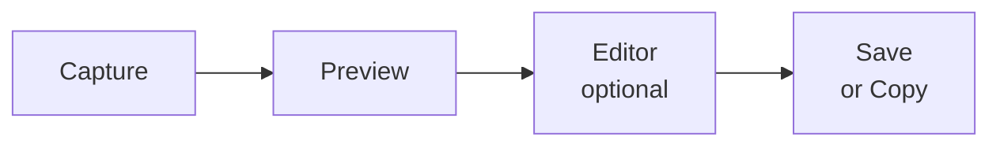

# ChalKak User Guide

[한국어 가이드](USER_GUIDE.ko.md)

ChalKak is a preview-first screenshot tool for Wayland + Hyprland. Capture, review, annotate, and share — all from the keyboard.

## Demo

<https://github.com/user-attachments/assets/2d2ed794-f86e-4216-b5f1-7dcb513791d4>

---

## Table of Contents

1. [Quick Start](#1-quick-start)
2. [Requirements](#2-requirements)
3. [Installation](#3-installation)
4. [Capture Modes](#4-capture-modes)
5. [Workflow Overview](#5-workflow-overview)
6. [Preview](#6-preview)
7. [Editor](#7-editor)
8. [Editor Tools](#8-editor-tools)
9. [Navigation and Zoom](#9-navigation-and-zoom)
10. [Hyprland Keybinding Setup](#10-hyprland-keybinding-setup)
11. [File Locations](#11-file-locations)
12. [Clipboard Behavior](#12-clipboard-behavior)
13. [Workflow Recipes](#13-workflow-recipes)
14. [Configuration](#14-configuration)
15. [Troubleshooting](#15-troubleshooting)

---

## 1. Quick Start

If you are setting up ChalKak for the first time:

1. Install ChalKak and confirm the binary: `which chalkak`
2. Set up Hyprland keybindings ([Section 10](#10-hyprland-keybinding-setup)).
3. Reload Hyprland: `hyprctl reload`
4. Press `Print` to capture a region. The preview window opens automatically.
5. In Preview: `s` to save, `c` to copy, `e` to open the editor.

That's it. The recommended workflow is keybinding-driven — bind capture commands to hotkeys and trigger them directly. Everything else in this guide is optional.

---

## 2. Requirements

**Desktop environment:** Wayland session with Hyprland.

**Runtime dependencies:**

| Command | Package | Purpose |
|---------|---------|---------|
| `hyprctl` | hyprland | Window management queries |
| `grim` | grim | Screen capture |
| `slurp` | slurp | Region / window selection |
| `wl-copy` | wl-clipboard | Clipboard operations |

**Environment variables:**

| Variable | Required | Purpose |
|----------|----------|---------|
| `HOME` | Yes | Config and save paths |
| `XDG_RUNTIME_DIR` | Recommended | Temp file storage |
| `XDG_CONFIG_HOME` | Optional | Config directory (default: `$HOME/.config`) |

**Optional dependencies:**

| Package | Purpose |
|---------|---------|
| `chalkak-ocr-models` | OCR text recognition (PaddleOCR v5 model files) |

**Verify everything at once:**

```bash
hyprctl version && grim -h && slurp -h && wl-copy --help && echo "All dependencies OK"
```

---

## 3. Installation

### From AUR

```bash
# Using an AUR helper (e.g., yay or paru)
yay -S chalkak

# Optional: install OCR model files for text recognition
yay -S chalkak-ocr-models
```

### From source

```bash
git clone <repo-url> chalkak
cd chalkak
cargo build --release
# Binary is at target/release/chalkak
```

### Verify

```bash
which chalkak
# Expected: /usr/bin/chalkak (AUR) or your custom path
```

---

## 4. Capture Modes

ChalKak supports three capture modes and a launchpad mode:

| Flag | Short form | Behavior |
|------|------------|----------|
| `--capture-region` | `--region` | Immediately starts region selection |
| `--capture-window` | `--window` | Immediately starts window selection |
| `--capture-full` | `--full` | Immediately captures the entire screen |
| `--launchpad` | — | Opens the launchpad window (primarily for development) |

```bash
chalkak --region        # Select and capture a region (recommended)
chalkak --window        # Select and capture a window
chalkak --full          # Capture full screen
chalkak --launchpad     # Launchpad UI (primarily for development)
```

The recommended approach is to bind these commands to Hyprland hotkeys ([Section 10](#10-hyprland-keybinding-setup)) and trigger captures directly from the keyboard. The `--launchpad` mode provides a button-based UI but is mainly intended for development and testing.

If multiple capture flags are given, the last one wins.

---

## 5. Workflow Overview

ChalKak follows a **Capture → Preview → (optional) Edit → Output** flow:



1. **Capture** — take a screenshot (region, window, or full screen).
2. **Preview** — inspect the result. Decide whether to keep, discard, or edit.
3. **Editor** — annotate with arrows, rectangles, text, blur, and more.
4. **Output** — save to file or copy to clipboard.

---

## 6. Preview

Preview is a confirmation step before saving or editing.

### Keyboard Shortcuts

| Key | Action |
|-----|--------|
| `s` | Save to file |
| `c` | Copy to clipboard |
| `e` | Open editor |
| `o` | OCR — extract text from entire image and copy to clipboard |
| `Delete` | Discard capture |
| `Esc` | Close preview |

Preview is a useful safety gate: verify the capture content before committing to save or edit.

---

## 7. Editor

### General Shortcuts

| Shortcut | Action |
|----------|--------|
| `Ctrl+S` | Save output image |
| `Ctrl+C` | Copy to clipboard |
| `Ctrl+Z` | Undo |
| `Ctrl+Shift+Z` | Redo |
| `Delete` / `Backspace` | Delete selected object |
| `Tab` | Toggle tool options panel |
| `Esc` | Return to Select tool, or close editor if already in Select |

### Tool Shortcuts

| Key | Tool |
|-----|------|
| `v` | Select |
| `h` | Pan |
| `b` | Blur |
| `p` | Pen |
| `a` | Arrow |
| `r` | Rectangle |
| `c` | Crop |
| `t` | Text |
| `o` | OCR |

---

## 8. Editor Tools

### Select (`v`)

- Click an object to select it. Drag to move, use handles to resize.
- Drag on empty canvas to create a selection box.
- `Delete` removes the selected object.

### Pan (`h` or hold `Space`)

- Hold the pan key and drag to move the viewport.
- Works as a temporary modifier: hold `Space` while using any tool to pan without switching tools.

### Blur (`b`)

- Drag to define a blur region.
- **Options:** intensity (1–100, default: 55).
- Blur regions can be resized after placement.
- Very small or zero-area drags are ignored.

### Pen (`p`)

- Drag to draw freehand strokes.
- **Options:** color, opacity (1–100%), thickness (1–255).
- Settings persist across strokes within the session.

### Arrow (`a`)

- Drag from start to end to draw a directional arrow.
- **Options:** color, thickness (1–255), head size (1–255).

### Rectangle (`r`)

- Drag to create a rectangle.
- **Options:** color, thickness (1–255), fill (on/off), corner radius.
- Can be outline-only or filled.

### Crop (`c`)

- Drag to define the crop region. The crop is applied at render time (save/copy), not destructively.
- **Aspect ratio presets:** Free, 16:9, 1:1, 9:16, Original (matches canvas ratio).
- Minimum crop size: 16×16 pixels.
- `Esc` cancels the crop and returns to Select.

### Text (`t`)

- Click to create a text box. Double-click existing text to edit.
- **Options:** color, size (1–255), weight (100–1000), font family (Sans / Serif).
- Text editing keys:

| Key | Action |
|-----|--------|
| `Enter` / `Shift+Enter` | New line |
| `Ctrl+Enter` | Commit text |
| `Ctrl+C` | Copy selected text |
| Arrow keys | Move cursor |
| `Backspace` | Delete character |
| `Esc` | Exit text editing |

### OCR (`o`)

- Drag to define a region, then text is recognized and copied to clipboard.
- In Preview, press `o` to extract text from the entire image.
- Recognized text is automatically copied to clipboard with a toast notification.
- Requires `chalkak-ocr-models` package (PaddleOCR v5 model files).
- Language is auto-detected from system `LANG` environment variable. Override via `ocr_language` in `config.json` ([Section 14.3](#143-configjson)).
- Supported languages: Korean (`ko`), English (`en`), Chinese (`zh`), Latin, Cyrillic (`ru`), Arabic (`ar`), Thai (`th`), Greek (`el`), Devanagari (`hi`), Tamil (`ta`), Telugu (`te`).

### Tool Options Panel

Press `Tab` to toggle the options panel. This panel exposes configurable properties for the active tool (color, thickness, opacity, etc.). Color palette, stroke width presets, and text size presets can be customized via `theme.json` ([Section 14.1](#141-themejson)).

---

## 9. Navigation and Zoom

Default editor navigation (customizable via `keybindings.json`):

| Action | Default Shortcut |
|--------|------------------|
| Pan | Hold `Space` + drag |
| Zoom in | `Ctrl++`, `Ctrl+=`, `Ctrl+KP_Add` |
| Zoom out | `Ctrl+-`, `Ctrl+_`, `Ctrl+KP_Subtract` |
| Actual size (100%) | `Ctrl+0`, `Ctrl+KP_0` |
| Fit to view | `Shift+1` |
| Scroll zoom | `Ctrl` + scroll wheel |

---

## 10. Hyprland Keybinding Setup

This section connects ChalKak to your Hyprland hotkeys. For most users, this is the only setup needed after installation.

### 10.1 Check binary path

```bash
which chalkak
```

- AUR install: typically `/usr/bin/chalkak`
- Cargo install: typically `~/.cargo/bin/chalkak`

### 10.2 Create a dedicated config file

Keep ChalKak bindings in their own file so your main config stays clean.

Add this line once to `~/.config/hypr/hyprland.conf`:

```conf
source = ~/.config/hypr/chalkak.conf
```

### 10.3 Recommended preset (Print key)

Copy this into `~/.config/hypr/chalkak.conf`:

```conf
# ChalKak screenshot bindings (Print-based)
unbind = , Print
unbind = SHIFT, Print
unbind = CTRL, Print
bindd = , Print, ChalKak region capture, exec, /usr/bin/chalkak --capture-region
bindd = SHIFT, Print, ChalKak window capture, exec, /usr/bin/chalkak --capture-window
bindd = CTRL, Print, ChalKak full capture, exec, /usr/bin/chalkak --capture-full
```

> Replace `/usr/bin/chalkak` with your actual path if different. The `unbind` lines prevent conflicts with existing bindings.

**Or generate it automatically:**

```bash
CHALKAK_BIN="$(command -v chalkak)"
mkdir -p "$HOME/.config/hypr"
cat > "$HOME/.config/hypr/chalkak.conf" <<EOF
unbind = , Print
unbind = SHIFT, Print
unbind = CTRL, Print
bindd = , Print, ChalKak region capture, exec, ${CHALKAK_BIN} --capture-region
bindd = SHIFT, Print, ChalKak window capture, exec, ${CHALKAK_BIN} --capture-window
bindd = CTRL, Print, ChalKak full capture, exec, ${CHALKAK_BIN} --capture-full
EOF
```

### 10.4 My setup

I'm used to the macOS screenshot shortcuts (`⌥⇧3`/`⌥⇧4`), so I recreated a similar layout on Hyprland. `code:11`–`code:13` are the keycodes for the `2`/`3`/`4` keys:

```conf
# Chalkak screenshot bindings (Option = ALT)
unbind = ALT SHIFT, 2
unbind = ALT SHIFT, 3
unbind = ALT SHIFT, 4
bindd = ALT SHIFT, code:11, Chalkak region capture, exec, chalkak --capture-region
bindd = ALT SHIFT, code:12, Chalkak window capture, exec, chalkak --capture-window
bindd = ALT SHIFT, code:13, Chalkak full capture, exec, chalkak --capture-full
```

> `code:N` binds by keycode in Hyprland, locking to the physical key position regardless of keyboard layout. Useful if you switch between layouts.

### 10.5 Alternative presets

<details>
<summary>Alt+Shift + mnemonic letters (R/W/F)</summary>

```conf
unbind = ALT SHIFT, R
unbind = ALT SHIFT, W
unbind = ALT SHIFT, F
bindd = ALT SHIFT, R, ChalKak region capture, exec, /usr/bin/chalkak --capture-region
bindd = ALT SHIFT, W, ChalKak window capture, exec, /usr/bin/chalkak --capture-window
bindd = ALT SHIFT, F, ChalKak full capture, exec, /usr/bin/chalkak --capture-full
```
</details>

<details>
<summary>Alt+Shift + number row (2/3/4)</summary>

```conf
unbind = ALT SHIFT, 2
unbind = ALT SHIFT, 3
unbind = ALT SHIFT, 4
bindd = ALT SHIFT, 2, ChalKak region capture, exec, /usr/bin/chalkak --capture-region
bindd = ALT SHIFT, 3, ChalKak window capture, exec, /usr/bin/chalkak --capture-window
bindd = ALT SHIFT, 4, ChalKak full capture, exec, /usr/bin/chalkak --capture-full
```
</details>

<details>
<summary>Minimal (region only)</summary>

```conf
unbind = , Print
bindd = , Print, ChalKak region capture, exec, /usr/bin/chalkak --capture-region
```
</details>

### 10.6 Reload and verify

```bash
hyprctl reload
hyprctl binds -j | jq -r '.[] | select(.description|test("ChalKak")) | [.description,.arg] | @tsv'
```

If you see `ChalKak ... capture` entries with the correct path, bindings are active.

### 10.7 Omarchy users

If you use Omarchy, ensure `source = ~/.config/hypr/chalkak.conf` is loaded within your Hyprland config chain. If you manage config via symlinked dotfiles, edit the link target. If keybindings stopped working after switching from Cargo to AUR install, check for stale paths in your bindings.

---

## 11. File Locations

| Type | Path | Example |
|------|------|---------|
| Temp captures | `$XDG_RUNTIME_DIR/` (fallback: `/tmp/chalkak/`) | `capture_<id>.png` |
| Saved screenshots | `$HOME/Pictures/` | `capture-1739698252000000000.png` |
| Config directory | `$XDG_CONFIG_HOME/chalkak/` (fallback: `$HOME/.config/chalkak/`) | `theme.json`, `keybindings.json` |

ChalKak creates these directories automatically when needed.

**Temp file cleanup:** ChalKak removes per-capture temp files when you close or delete a preview. It also prunes stale `capture_*.png` files (older than 24 hours) at startup.

---

## 12. Clipboard Behavior

When you copy from ChalKak (Preview `c` or Editor `Ctrl+C`), the clipboard receives multiple formats so different apps can pick the best one:

| Format | Content | Used by |
|--------|---------|---------|
| `image/png` | Raw PNG image bytes | Image editors, browsers, chat apps, coding agents |
| `text/uri-list` | File URI (`file:///path/to/image.png`) | File managers |
| `x-special/gnome-copied-files` | GNOME file copy format | Nautilus, GNOME apps |
| `text/plain;charset=utf-8` | Absolute file path (UTF-8) | Modern text editors, terminals |
| `text/plain` | Absolute file path | Legacy terminals, text editors |

This means you can paste into image-aware apps (they receive the PNG data) or file managers (they receive the file reference).

---

## 13. Workflow Recipes

### Quick one-shot capture

```
Print → select region → c (copy to clipboard)
```

Two keystrokes and a mouse drag — screen to clipboard.

### Documentation screenshot with annotations

```
Shift+Print → e (editor) → r (rectangle) / a (arrow) / t (text) → Ctrl+S (save)
```

### Privacy-safe sharing (blur sensitive info)

```
Ctrl+Print → e (editor) → b (blur) → drag over sensitive areas → Ctrl+C (copy)
```

### Extract text from a screenshot (OCR)

```
Print → select region → e (editor) → o (OCR tool) → drag over text → copied to clipboard
```

Or from preview for the entire image:

```
Print → select region → o (OCR) → copied to clipboard
```

### Feed context to a coding agent

```
Print → select region → c (copy) → paste into Claude Code / Codex CLI
```

Many coding agents accept clipboard images directly. ChalKak copies PNG bytes to the clipboard, so paste works without saving to a file first.

---

## 14. Configuration

ChalKak works without any configuration files. All settings below are optional overrides.

**Config directory:** `$XDG_CONFIG_HOME/chalkak/` (default: `~/.config/chalkak/`)

### 14.1 `theme.json`

Controls theme mode, UI colors, and editor defaults.

**Minimal example** (just set theme mode):

```json
{
  "mode": "system"
}
```

`mode` values: `system`, `light`, `dark`. When set to `system`, ChalKak follows your desktop theme preference, falling back to dark mode if detection fails.

**Full example** with `common` defaults and per-mode overrides:

```json
{
  "mode": "system",
  "colors": {
    "common": {
      "focus_ring_color": "#8cc2ff",
      "border_color": "#2e3a46",
      "text_color": "#e7edf5"
    },
    "dark": {
      "panel_background": "#10151b",
      "canvas_background": "#0b0f14",
      "accent_gradient": "linear-gradient(135deg, #6aa3ff, #8ee3ff)",
      "accent_text_color": "#07121f"
    },
    "light": {
      "panel_background": "#f7fafc",
      "canvas_background": "#ffffff",
      "accent_gradient": "linear-gradient(135deg, #3b82f6, #67e8f9)",
      "accent_text_color": "#0f172a"
    }
  },
  "editor": {
    "common": {
      "rectangle_border_radius": 10,
      "default_tool_color": "#ff6b6b",
      "default_text_size": 18,
      "default_stroke_width": 3,
      "tool_color_palette": ["#ff6b6b", "#ffd166", "#3a86ff", "#06d6a0"],
      "stroke_width_presets": [2, 4, 8, 12],
      "text_size_presets": [14, 18, 24, 32]
    },
    "dark": {
      "default_tool_color": "#f4f4f5"
    },
    "light": {
      "default_tool_color": "#18181b"
    }
  }
}
```

**Merge order:** built-in defaults → `common` → current mode (`dark` or `light`). Every field is optional; missing keys use built-in defaults.

#### Color keys (`colors.common` / `colors.dark` / `colors.light`)

`focus_ring_color`, `focus_ring_glow`, `border_color`, `panel_background`, `canvas_background`, `text_color`, `accent_gradient`, `accent_text_color`

#### Editor keys (`editor.common` / `editor.dark` / `editor.light`)

| Key | Type | Notes |
|-----|------|-------|
| `rectangle_border_radius` | number | Default corner radius for rectangles |
| `default_tool_color` | string | `#RRGGBB` or `RRGGBB` |
| `default_text_size` | number | 1–255 |
| `default_stroke_width` | number | 1–255 |
| `tool_color_palette` | array | Up to 6 items, strict `#RRGGBB` format |
| `stroke_width_presets` | array | Up to 6 items, range 1–64 |
| `text_size_presets` | array | Up to 6 items, range 8–160 |
| `selection_drag_fill_color` | string | `#RRGGBB` or `#RRGGBBAA` |
| `selection_drag_stroke_color` | string | `#RRGGBB` or `#RRGGBBAA` |
| `selection_outline_color` | string | `#RRGGBB` or `#RRGGBBAA` |
| `selection_handle_color` | string | `#RRGGBB` or `#RRGGBBAA` |
Invalid values are ignored with a warning in logs.

#### Legacy compatibility

The older flat schema (`editor` at top level + `editor_modes.dark/light`) is still supported. When both schemas are present, precedence is: `editor` (flat) → `editor.common` → `editor_modes.<mode>` → `editor.<mode>`.

### 14.2 `keybindings.json`

Overrides editor navigation defaults. If this file is missing, built-in defaults are used.

```json
{
  "editor_navigation": {
    "pan_hold_key": "space",
    "zoom_scroll_modifier": "control",
    "zoom_in_shortcuts": ["ctrl+plus", "ctrl+equal", "ctrl+kp_add"],
    "zoom_out_shortcuts": ["ctrl+minus", "ctrl+underscore", "ctrl+kp_subtract"],
    "actual_size_shortcuts": ["ctrl+0", "ctrl+kp_0"],
    "fit_shortcuts": ["shift+1"]
  }
}
```

**Notes:**

- `zoom_scroll_modifier` values: `none`, `control`, `shift`, `alt`, `super`.
- Key name aliases are normalized: `ctrl`/`control`, `cmd`/`command`/`win` → `super`, `option` → `alt`.
- Each shortcut chord must have exactly one non-modifier key (e.g., `ctrl+plus`).
- Shortcut arrays must not be empty.
- If parsing fails, ChalKak logs a warning and falls back to defaults.

**Validate after editing:**

```bash
jq empty "${XDG_CONFIG_HOME:-$HOME/.config}/chalkak/keybindings.json"
```

### 14.3 `config.json`

Application-level settings. If this file is missing, built-in defaults are used.

```json
{
  "ocr_language": "korean"
}
```

#### `ocr_language`

Overrides the OCR recognition language. If omitted, ChalKak auto-detects from the system `LANG` environment variable.

| Value | Language |
|-------|----------|
| `korean` / `ko` | Korean |
| `en` / `english` | English |
| `chinese` / `zh` / `ch` | Chinese |
| `latin` | Latin script languages |
| `cyrillic` / `ru` / `uk` / `be` | Cyrillic script languages |
| `arabic` / `ar` | Arabic |
| `th` / `thai` | Thai |
| `el` / `greek` | Greek |
| `devanagari` / `hi` | Devanagari script languages |
| `ta` / `tamil` | Tamil |
| `te` / `telugu` | Telugu |

---

## 15. Troubleshooting

### Capture does not start

| Check | Fix |
|-------|-----|
| Missing dependency | Run the verification command from [Section 2](#2-requirements) |
| Not in Hyprland session | Ensure `HYPRLAND_INSTANCE_SIGNATURE` is set: `echo $HYPRLAND_INSTANCE_SIGNATURE` |
| slurp selection cancelled | Retry with `chalkak --region` and complete the selection |

### Clipboard copy fails

| Check | Fix |
|-------|-----|
| `wl-copy` not found | Install `wl-clipboard` package |
| Copy returns empty | Verify you are in a live Wayland GUI session (not SSH or TTY) |

### Save fails

| Check | Fix |
|-------|-----|
| `HOME` not set | Set `HOME` environment variable |
| No write permission | Check permissions on `~/Pictures`: `ls -ld ~/Pictures` |

### OCR not working

| Check | Fix |
|-------|-----|
| "Model files not found" toast | Install `chalkak-ocr-models` package, or place model files in `~/.local/share/chalkak/models/` |
| Wrong language recognized | Set `ocr_language` in `config.json` ([Section 14.3](#143-configjson)) or check system `LANG` |
| "No text found" on valid text | Try a larger selection area; very small or low-contrast text may not be detected |

### Temp files accumulate

ChalKak cleans up temp files automatically on close/delete and prunes stale files at startup. If files still accumulate:

1. Ensure `XDG_RUNTIME_DIR` is set (avoids `/tmp/chalkak/` fallback).
2. Close previews/editors normally instead of force-killing.
3. Manual cleanup: `rm $XDG_RUNTIME_DIR/capture_*.png` (or `/tmp/chalkak/capture_*.png`).
